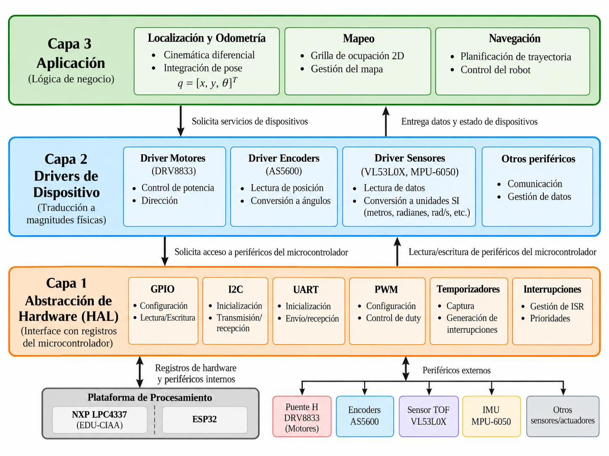

# Arquitectura de software

La arquitectura de Arturito separa la lógica del rover, el manejo de
dispositivos y los detalles específicos de cada plataforma.

## Organización

El firmware se organiza conceptualmente en tres capas:

Application → Device Drivers → HAL

| Capa | Responsabilidad |
| --- | --- |
| Application | Implementar la lógica del rover y coordinar los módulos que la implementen. |
| Device Drivers | Proporcionar una interfaz para utilizar sensores y actuadores. |
| HAL | Abstraer servicios y periféricos dependientes de la plataforma. |

La separación adoptada y sus consecuencias se documentan en
[ADR-0001](decisions/0001-firmware-architecture.md).

## Application

Application contiene la lógica propia del sistema, incluyendo módulos
como odometría, mapeo, navegación, control y comunicaciones.

Trabaja con conceptos del dominio —pose, velocidades, mapa y comandos—
sin depender de APIs específicas de EDU-CIAA, ESP32 o de los
dispositivos utilizados.

## Device Drivers

Esta capa encapsula el uso de los dispositivos externos del rover, por
ejemplo:

- MPU6050
- VL53L0X
- AS5600
- DRV8833

Cada driver expone a Application una interfaz consistente para utilizar
el dispositivo y encapsula los detalles propios de éste, como
inicialización, configuración, registros, escalas o validación de
mediciones.

La implementación de un driver puede utilizar una biblioteca existente
cuando resulte conveniente o implementar directamente el protocolo del
dispositivo utilizando los servicios proporcionados por HAL.

## HAL

HAL abstrae las operaciones dependientes de la plataforma necesarias por
las capas superiores.

Entre sus servicios pueden encontrarse:

- I2C
- UART
- GPIO
- PWM
- temporización
- interrupciones

La interfaz de estos servicios debe mantenerse independiente de la
plataforma.

Por ejemplo:

    hal_i2c_read(...)
        ├── EDU-CIAA → implementación LPC4337 / sAPI / LPCOpen
        └── ESP32    → implementación correspondiente a ESP32

Una implementación HAL puede utilizar una biblioteca de plataforma o
acceder directamente a registros del microcontrolador. Ese detalle queda
encapsulado y no es visible para Device Drivers ni Application.

Los backends de EDU-CIAA y ESP32 forman parte de HAL y no constituyen
una capa adicional.

La elección de EDU-CIAA como plataforma objetivo y ESP32 como plataforma
de desarrollo y validación se registra en
[ADR-0002](decisions/0002-target-platform.md).

## FreeRTOS

FreeRTOS se considera infraestructura transversal y no una capa del
firmware.

Proporciona scheduling, temporización y mecanismos de comunicación y
sincronización entre tareas. La división en tareas no modifica las
responsabilidades de los módulos anteriores.

Siempre que sea posible, los algoritmos independientes del hardware
deben mantenerse desacoplados del RTOS para facilitar su prueba y
reutilización.

Esta decisión se documenta en
[ADR-0003](decisions/0003-freertos-runtime.md).