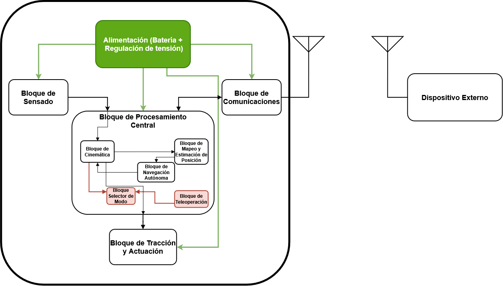

# Descripción del sistema

Arturito es un rover diferencial concebido para explorar interiores, estimar su posición, construir un mapa de ocupación 2D y navegar evitando obstáculos. Su funcionamiento integra sensado, procesamiento, comunicaciones, tracción y alimentación, junto con un dispositivo externo para visualizar información e interactuar con el robot.

Este documento presenta los bloques funcionales y sus relaciones. La organización del firmware se desarrolla en [software-architecture.md](software-architecture.md); el avance de implementación se registran en [development-status.md](development-status.md).

## Esquema general

Los bloques resaltados en rojo —Selector de Modo y Teleoperación— representan funcionalidades secundarias. Las conexiones verdes muestran la distribución de alimentación; las demás conexiones representan el intercambio de información y comandos.

## Bloques funcionales

| Bloque | Función |
| --- | --- |
| Bloque de Sensado | Recolecta mediciones de distancia e información inercial y del giro de las ruedas para entregarlas al Bloque de Procesamiento Central. |
| Bloque de Comunicaciones | Establece el enlace con el dispositivo externo para intercambiar información del mapa, estado y posición del robot, además de recibir comandos. |
| Bloque de Tracción y Actuación | Recibe comandos de movimiento y utiliza la energía de la alimentación para accionar los motores de las ruedas de forma independiente. |
| Bloque de Procesamiento Central | Integra cinemática, mapeo, estimación de posición y navegación. También contempla la selección de modo y la teleoperación como funcionalidades secundarias. |
| Alimentación (Batería + Regulación de tensión) | Proporciona y regula la energía necesaria para los sensores, el procesamiento, las comunicaciones y la actuación. |
| Dispositivo Externo | Recibe y muestra el mapa y el estado del robot; permite enviar comandos de inicio y parada. Como objetivo secundario, permite seleccionar el modo y controlar el movimiento de forma remota. |

### Bloque de Procesamiento Central

| Subbloque | Función |
| --- | --- |
| Bloque de Cinemática | Utiliza la geometría del chasis y las mediciones de ruedas e IMU para estimar la pose odométrica. También convierte las consignas de movimiento en acciones para cada rueda. |
| Bloque de Mapeo y Estimación de Posición | Combina la pose odométrica con las mediciones de distancia para construir la grilla de ocupación y proporcionar el mapa y la estimación de posición a navegación y comunicaciones. |
| Bloque de Navegación Autónoma | Evalúa el mapa y la posición del robot, selecciona hacia dónde avanzar y genera las consignas de movimiento que recibe Cinemática. |
| Bloque Selector de Modo | Selecciona el origen de los comandos de movimiento según el modo elegido: navegación autónoma o teleoperación. Es un objetivo secundario. |
| Bloque de Teleoperación | Recibe las instrucciones de movimiento enviadas desde el dispositivo externo para el control manual del rover. Es un objetivo secundario. |

## Flujo de información

El Bloque de Sensado entrega sus mediciones al procesamiento central. Cinemática estima el movimiento del robot y proporciona la pose odométrica a Mapeo y Estimación de Posición. Este último combina la pose y las distancias para construir una representación del entorno.

Navegación Autónoma utiliza esa representación y la posición estimada para decidir el siguiente movimiento. Cinemática transforma las consignas en acciones por rueda y el Bloque de Tracción y Actuación produce el desplazamiento. Las nuevas mediciones cierran este ciclo.

El Bloque de Comunicaciones conecta el procesamiento central con el Dispositivo Externo, donde se visualizan el mapa y el estado y se ingresan comandos. Si se incorporan las funcionalidades secundarias, Teleoperación y Selector de Modo permiten elegir entre comandos autónomos y manuales.

Los requisitos verificables están en [Requisitos](requirements.md), y la selección de componentes y sus conexiones se describen en [Hardware](hardware.md).
